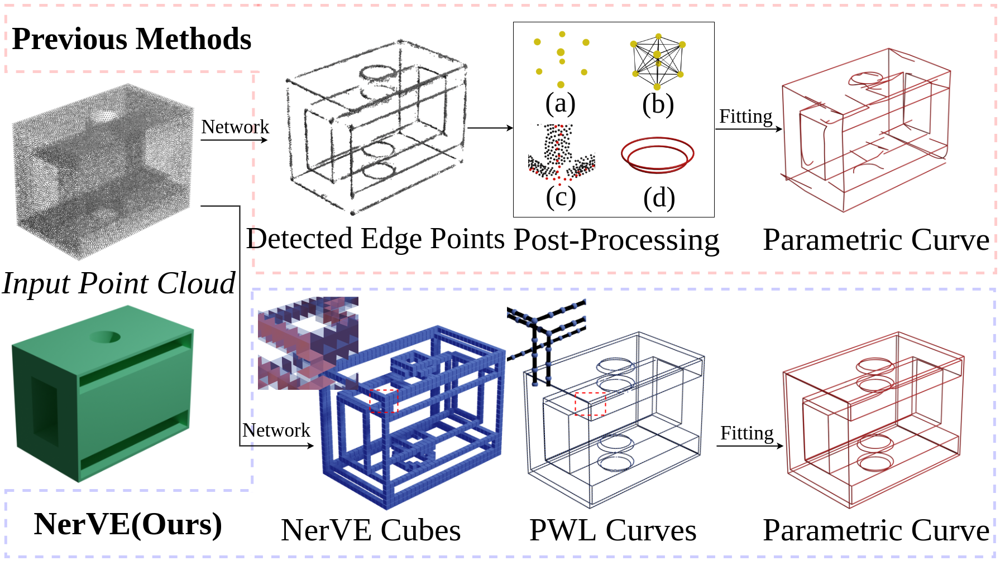
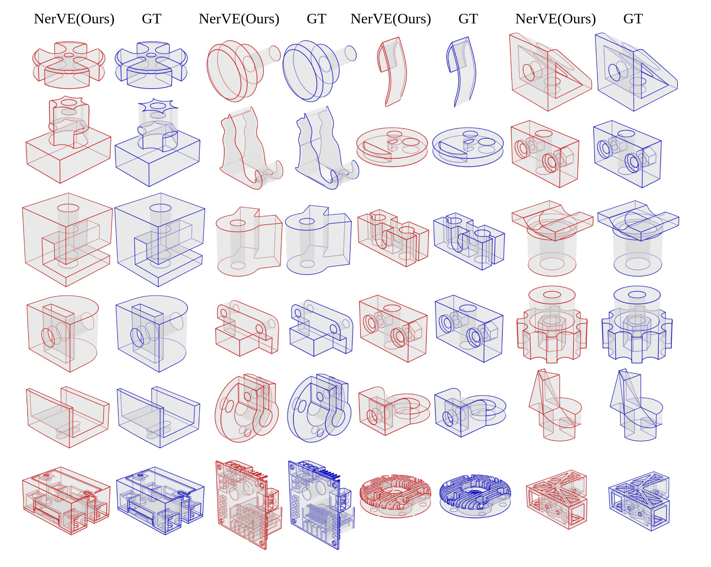

# NerVE
Official PyTorch implementation for paper [NerVE: Neural Volumetric Edges for Parametric Curve Extraction from Point Cloud](https://arxiv.org/abs/2303.16465).

### [Paper](https://arxiv.org/abs/2303.16465)



## Requirements
Install from requirements.txt.
```
pip install -r requirements.txt
```

Build the avg_pooling module. **NOTE:** the CUDA version of your installed `PyTorch` has to be consistent with the version of your `nvcc`.
```
cd network/avg_pooling
python setup.py build_ext
python setup.py install
```

[Blender](https://www.blender.org/), for visualization.


## Quick Start
For a quick and easy try, we provide the data for demo and pre-trained model checkpoints:

- [demo_data_checkpoint.zip](https://drive.google.com/file/d/1WjzMNgNtoS8Mw7YM1M4hadTABQxLStvt/view?usp=sharing)

Unzip the downloaded file at the root, then get `demo/`(demo data) and `results/`(checkpoints). In the folder `demo/`, there are point cloud files of 4 CAD models from [ABC dataset](https://deep-geometry.github.io/abc-dataset/). Run the following code to obtain the NerVE prediction of network and corresponding piecewise-linear(PWL) curves:

```
python demo_predict_pwl.py
```

If everything goes well, we now have a file named `pred_nerve_pwl_curve.pkl` in the folder of each CAD model. Next convert these PWL curves to parametric curves by running:
```
python utils/pwl2CAD/CAD_curve.py
```

Finally, render the parametric curves and NerVE PWL curves with Blender:
```
blender -b --python utils/visualization_blender/batch_render_curve.py
```
Also we provide some Blender scripts so that you can visualize the curves and NerVE cube grid in Blender. Check `utils/visualization_blender`.

## Dataset and Training

Firstly, a ready-to-use dataset can be downloaded for training:
- [NerVE64Dataset.zip](https://drive.google.com/file/d/15t7lh1NhyZ1n1w8vhxQvJsFTRMkReK1U/view?usp=sharing)

Note this dataset can be only used for NerVE grid of resolution 64^3. For preparing your dataset, check `utils/prepare_data`. 

For training, the code can be simply run like:
```
python train_net.py -c /path/to/your/config.yaml
```

Some examples of the config file can be found in `exp/template`. Note that you should change `root_path` and `root of dataset` in the config file, before you start to train the model. Here we have three config files(`cube.yaml`, `face.yaml`, `geom.yaml`) for a complete NerVE model, because we found such separate training is easier to converge and enough to produce good results. 

To evaluate the predicted curves, you can use functions from `utils/pwl2CAD/eval_cad_curve.py` to calculate their Chamfer distance and Hausdorff distance with ground truth curves.


## More Results



## Citation
If you find our work useful in your research, please consider citing:

	@misc{zhu2023nerve,
      title={NerVE: Neural Volumetric Edges for Parametric Curve Extraction from Point Cloud}, 
      author={Xiangyu Zhu and Dong Du and Weikai Chen and Zhiyou Zhao and Yinyu Nie and Xiaoguang Han},
      year={2023},
      eprint={2303.16465},
      archivePrefix={arXiv},
      primaryClass={cs.CV}
}